  

  <a href="https://yudui.dev/"><b>yudui.dev</b></a>

  I make games and interfaces that feel alive — from little desktop details to whole worlds to dig through.

  

  

  

<!-- Картинки рисует scripts/render.mjs; статистика обновляется каждые 6 часов: .github/workflows/profile.yml -->
